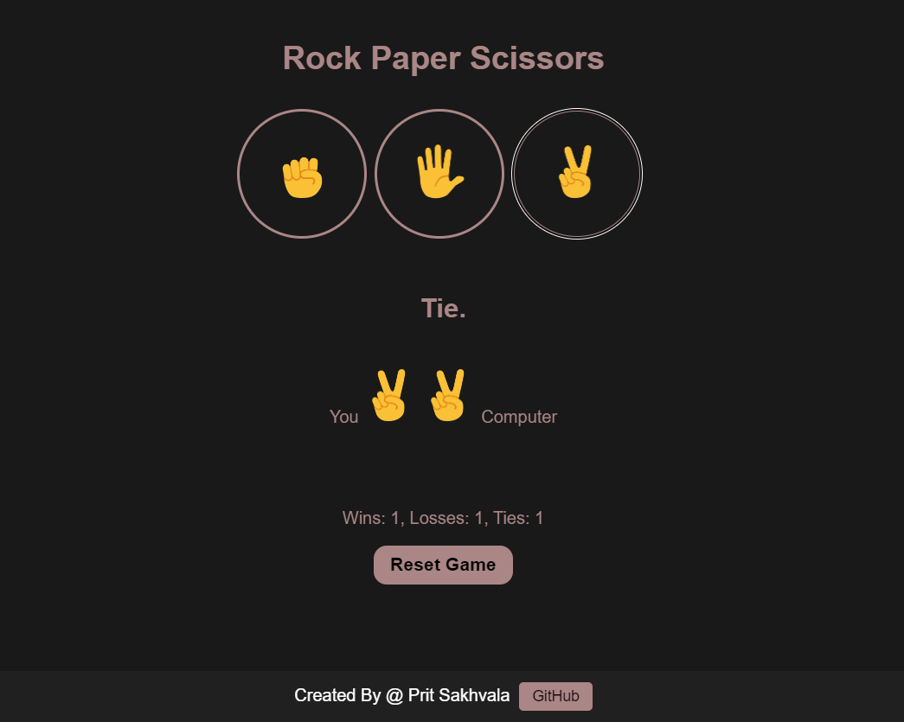

# Rock Paper Scissors Game

## Description

This is a simple Rock Paper Scissors game implemented using HTML, CSS, and JavaScript. It allows users to play the classic game against the computer.

## Features

- User-friendly interface.
- Responsive design, suitable for various devices.
- Option to choose between rock, paper, or scissors.
- Computer AI for generating random choices.
- Display of game results (win, lose, or draw).
- Option to play again after each round.

## Installation

1. Clone this repository to your local machine:
2. Navigate to the project directory.
3. Open `index.html` in your web browser.

## Usage

- Choose your weapon (rock, paper, or scissors) by clicking on the corresponding icon.
- The computer will randomly select its weapon.
- The result of the round will be displayed.
- Click the "Play Again" button to start a new round.

## Contributing

Contributions are welcome! Please fork the repository and create a pull request with your proposed changes.

## License

This project is licensed under the MIT License - see the [LICENSE](LICENSE) file for details.
